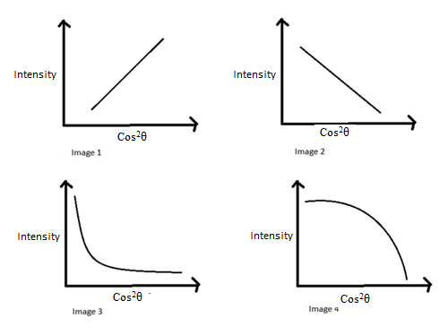
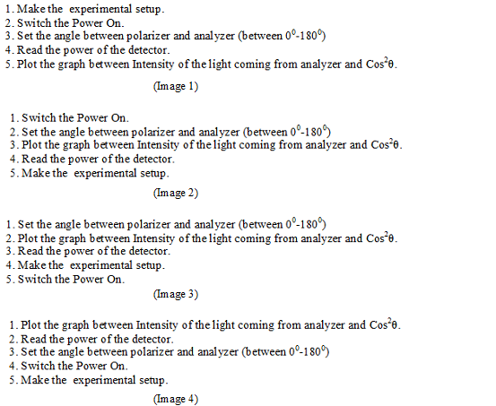

## Pedagogy (Round 1)

 
 
<b> Experiment: Polarization of light using He – Ne Laser     

<b>Discipline | <b> Pysicsal Sciences
:--|:--|
<b> Lab | <b> Basics of Physics
<b> Experiment|     <b> 9. Polarization of light using He – Ne Laser 

<h4> [1. Focus Area](#LO)
<h4> [2. Learning Objectives ](#LO)
<h4> [3. Instructional Strategy](#IS)
<h4> [4. Task & Assessment Questions](#AQ)
<h4> [5. Simulator Interactions](#SI)

#### 1. Focus Area :  Reinforce theoretical concept

#### 2. Learning Objectives and Cognitive Level

Sr. No |	Learning Objective	| Cognitive Level | Action Verb
:--|:--|:--|:-:
1.| Identify the relation between Intensity of plane polarized light and the intensity of light coming out of analyzer. | Recall |  Identify
2.| Describe the methodology to vary the angle between polarizer and analyzer and to observe the variation in the intensity of light coming out of analyzer. | Understand  | Describe 
3.| Predict the variation of intensity of the light coming out of Analyzer  by plotting a graph between Cos2θ and Power in the detector (Intensity of the falling light) |  Apply |  Predict
4.|  Examine the nature of plotted graph. | Analyze | Examine 
5.|  Conclude the linearity of the plotted graph and hence observe the law of Polarization (Malus law) | Evaluate  | Conclude 
 

    <b><a href="#top">↥ back to top</a></b>

 

#### 3. Instructional Strategy
###### Name of Instructional Strategy  :     Expository
###### Assessment Method: As per handout

<u> <b>Description: </b> of how you are going to implement the above Instructional Strategy in your Simulator: </u>
 
 Brief description as per handout

 

    <b><a href="#top">↥ back to top</a></b>

 

#### 4. Task & Assessment Questions:

Read the theory and comprehend the concepts related to the experiment. [LO1, LO2, LO3]
 

Sr. No |	Learning Objective	| Task to be performed by   the student  in the simulator | Assessment Questions as per LO & Task
:--|:--|:--|:-:
1.| Student will identifythe relation between Intensity of plane polarized light and the intensity of light coming out of analyzer. | Student will complete introduction. He will be given 4 images for the graph between Intensity of light coming out of analyzer and Cos2θ and will choose correct image from them. | Choose the correct image for the graph between Intensity of light coming out of analyzer and Cos2θ.  A.  Image1   B. Image2   C. Image3   <b> D. Image4 </b>  
2.| To enable the student to describe the methodology to vary the angle between polarizer and analyzer and to observe the variation in the intensity of light coming out of analyzer. | Student will be given 4 images for the correct procedure to be followed in the experiment. He will choose correct image from them. | Choose the correct image for the graph between Intensity of light coming out of analyzer and Cos2θ.   A.  Image1   B. Image2   C. Image3   <b> D. Image4 </b>  
3.| Student will be able to Predict the variation of intensity of the light coming out of Analyzer  by plotting a graph between Cos2θand Power in the detector (Intensity of the falling light) | Student will make experimental setup followed by setting angle between polarizer and analyzer and will read the power of detector due to intensity of light coming from analyzer. | Property of Polarization can be observed in:   a) Transverse wave   b) longitudinal wave    c) both   d) NOT   
4.| Student will examinethe nature of plotted graph. | Student will take observations for intensity of light coming from analyzer and plot graph between Intensity and Cos2θ. | Nature of graph between intensity light coming out of Analyzer and Cos2θ is :   a) Straight line   b) Parabolic    c) hyperbolic	   <b>  d) Circular </b>    
5.| Conclude the linearity of the plotted graph and hence observe the law of Polarization (Malus law) | Students will observe the nature of the  graph between intensity and Cos2θ and will conclude about law of Polarization (Malus law) | Almost no light will come out of analyzer if the angle between polarizer and analyzer is :   a) 00  b) 1800	  c) 900   d) NOT </b>    

 <u> You can add additional TASKS & Assessment Questions <u>
 

    <b><a href="#top">↥ back to top</a></b>

 

#### 4. Simulator Interactions:
 

Sr.No | What Students will do? |	What Simulator will do?	| Purpose of the task
:--|:--|:--|:--:
1.| Simulator will allow student to make experimental setup and will alert him in case of setup made.| Student will slide the power button of the simulator to ON position  | To initiate the simulator
2.| Simulator will show the green light indicating that the simulator is ready for use.  | Student will choose the desired angle between polarizer and analyzer.  |  To find the Intensity of the light coming out of Analyzer corresponding to each angle between polarizer and analyzer.
3.| Simulator will show the corresponding power in the detector. | Student will mention these power and angle values in the table. | To get the I and Cos2θ values with respect to the changing angle between polarizer and analyzer.
4.| Simulator will calculate I and Cos2θ values corresponding to each θ value entered in the Table. | Student will press the draw Graph button  |  To plot graph between I and Cos2θ
5.| Simulator will show plot between I and Cos2θ | Student will observe the nature of the graph.  |  To verify law of Polarization (Malus law)
