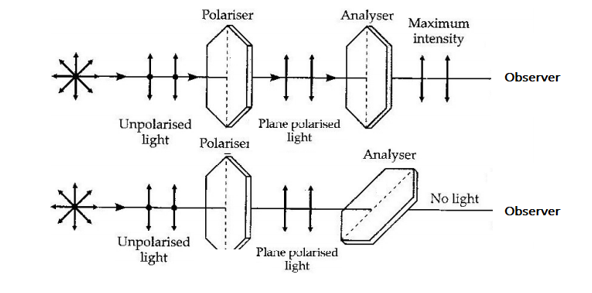

Whenever ordinary light or unpolarised light (transverse Electromagnetic wave in which vibrations of Electric vectors are perpendicular to the plane of propagation in all possible directions) passes through any polarizer it gets polarized. This polarized light when passes through any analyzer the intensity of the light coming out of analyzer depends on the angle formed between the plane of vibration of the Plane polarized light and the optic axis of the analyzer.  This situation is shown in the figure given below:  
 
The intensity of plane polarized light will be maximum when the polarization axis of the analyzer coincides with that of the polarizer and minimum when the two axes are crossed. For any other position of the axis of the analyzer θ (00 -1800) with respect to the axis of the polarizer, the output intensity (I) will follow the following relation:   
					I= Im  cos2⁡θ 						(1) 
Where the maximum intensity Im corresponds to the case where the abovementioned two axes matched. 

